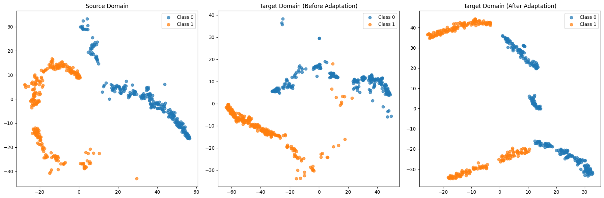
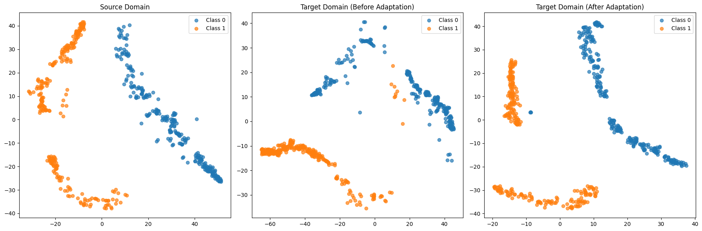
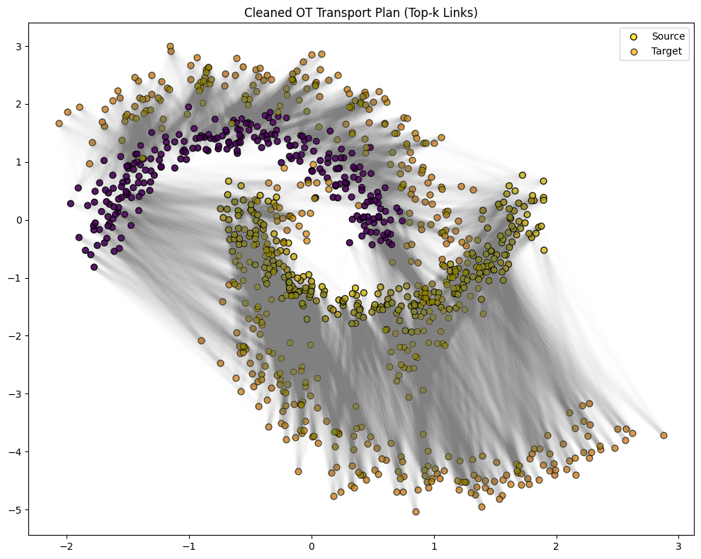
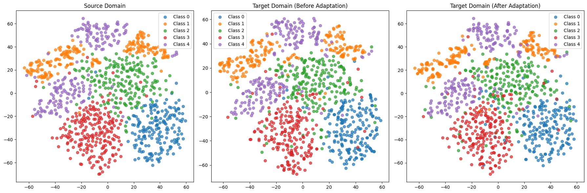
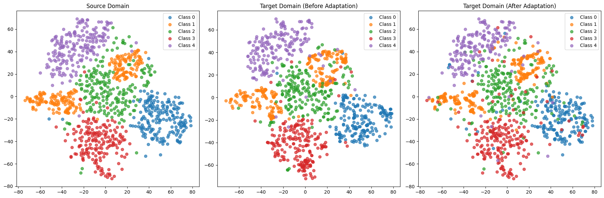
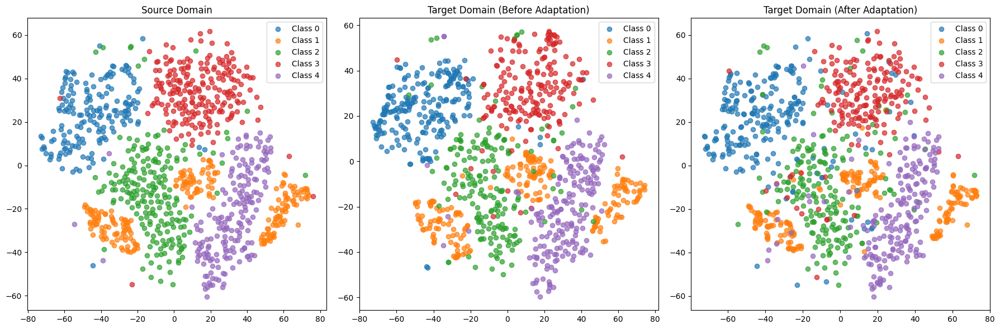
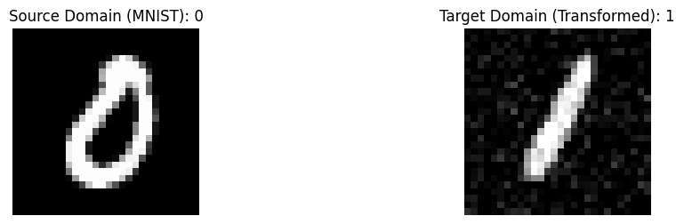
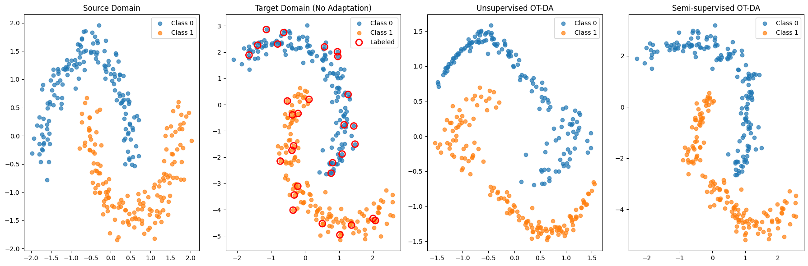
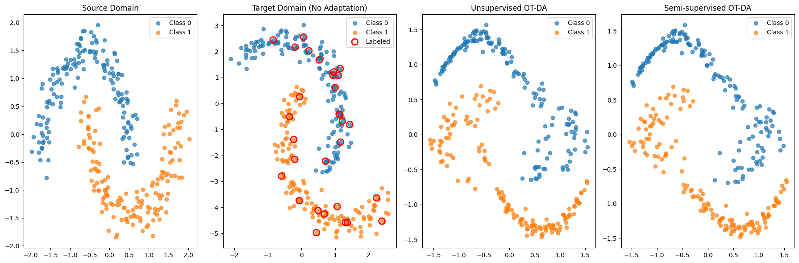
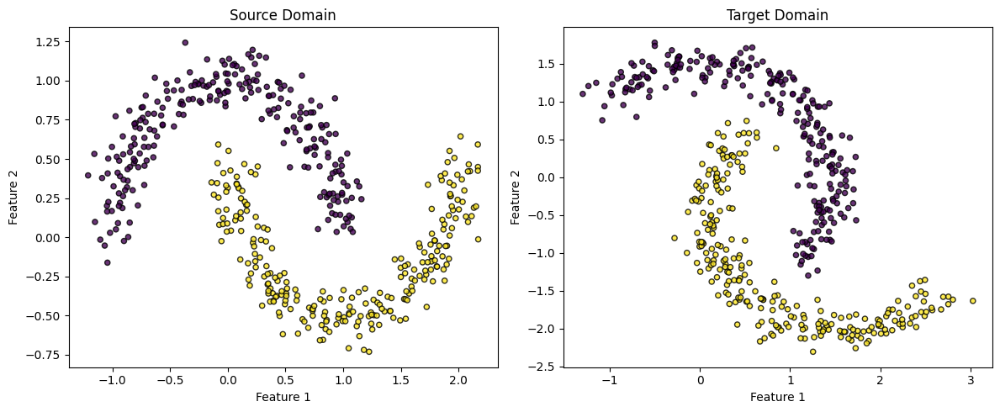

# Optimal Transport with Information Loss<br>and Cluster Consistency for Domain Adaptation

[](https://www.python.org/downloads/)
[](https://pythonot.github.io/)
[](documentation/CS_487_687_Final_Project_Report.pdf)
[](LICENSE)

**EN.601.487/687 Machine Learning: Coping with Non-Stationary Environments &middot; Johns Hopkins University**
<br>Rishi More &middot; Chuan Lin

[**Paper**](documentation/CS_487_687_Final_Project_Report.pdf)

---

## TL;DR

> We extend Sinkhorn optimal transport with two novel regularizers &mdash; an **information loss** term that preserves label structure without target labels, and a **cluster consistency** constraint that enforces data locality during transport. On Two-Moons and MNIST&rarr;USPS benchmarks, our methods improve 1-NN target accuracy from **82.8%&rarr;99.8%** and **71.6%&rarr;82.7%** respectively, substantially outperforming standard entropic OT.

---

## Overview

Domain adaptation via optimal transport maps source data to align with a target distribution. Standard Sinkhorn OT minimizes transport cost under entropic regularization but ignores two important structural properties:

1. **Information preservation** &mdash; source points with different labels should not be mapped to the same target region.
2. **Data locality** &mdash; nearby source points should be transported similarly.

We address both with two complementary contributions:

- **Info-Loss OT**: A KL-divergence penalty \(L = \langle M, H \rangle_F\) that discourages transport plans violating the information preservation assumption &mdash; *without requiring target labels*.
- **Cluster OT + Info-Loss**: Source points are clustered; the KL penalty is restricted to intra-cluster pairs, naturally enforcing data locality while reducing computational cost from \(O(n_s^2)\) to \(O(n_c^2)\).

---

## Key Results

| Dataset | No Adaptation | Sinkhorn OT | Cluster OT + Info-Loss | **Info-Loss OT** |
|---|---|---|---|---|
| Two-Moons | 82.8% | 87.2% | 96.4% | **99.8%** |
| MNIST &rarr; USPS | 71.6% | 77.4% | 80.8% | **82.7%** |

> All methods are evaluated using a 1-NN classifier trained on the transported source and tested on the original target data.

### Two-Moons Benchmark

|  |  |
|:--:|:--:|
| **Standard Sinkhorn OT** &mdash; Moderate class separation after transport. | **OT + Info-Loss (Ours)** &mdash; Sharper class clusters; information preservation penalty yields cleaner alignment. |

|  |  |
|:--:|:--:|
| **Cluster OT + Info-Loss (Ours)** &mdash; Data locality constraint preserves cluster coherence. | **Sinkhorn Transport Plan** &mdash; Visualizing source-to-target mass flow. |

### MNIST &rarr; USPS Benchmark

|  |  |
|:--:|:--:|
| **Standard Sinkhorn OT** &mdash; Digit classes partially overlap after transport. | **OT + Info-Loss (Ours)** &mdash; Tighter, more discriminative digit clusters. |

|  |  |
|:--:|:--:|
| **Cluster OT + Info-Loss (Ours)** &mdash; Best cluster separation across all methods. | **Sample Digits** &mdash; Source (MNIST) vs. Transformed Target. |

### Semi-Supervised Comparison

|  |  |
|:--:|:--:|
| **Standard Semi-Supervised OT** (10% target labels) | **Semi-Sup OT + Info-Loss (Ours)** &mdash; Consistently better alignment. |

---

## Method

### Information Loss

Given a transport plan \(\gamma \in \mathbb{R}^{n_s \times n_t}\), we define:

```
Affinity matrix:     M = γ γᵀ          (how strongly two source points share target mass)
Divergence matrix:   H[i,j] = KL(yᵢ ‖ yⱼ)   (label distribution disagreement)
Information loss:    L = ⟨M, H⟩_F       (penalizes shared transport to different-label regions)
```

The modified objective becomes:

```
γ* = argmin_γ  ⟨γ, C⟩_F  +  α · ⟨M, H⟩_F
         s.t.  γ1 = μₛ,  γᵀ1 = μₜ
```

**Key advantage over semi-supervised regularization**: our information loss only requires source labels &mdash; no target labels are needed.

### Cluster Consistency

```
┌────────────────────────────────────────────────────────────┐
│                    Source Domain                           │
│                                                            │
│   ┌──────────┐   ┌──────────┐        ┌──────────┐         │
│   │ Cluster 1│   │ Cluster 2│  ...   │ Cluster k│         │
│   │  x₁..xₘ │   │ xₘ₊₁..  │        │   ..xₙ  │         │
│   └────┬─────┘   └────┬─────┘        └────┬─────┘         │
│        │              │                    │               │
│   centroid c₁    centroid c₂          centroid cₖ          │
│        │              │                    │               │
│        └──────────────┼────────────────────┘               │
│                       ▼                                    │
│              OT: transport centroids                       │
│              (same plan → all cluster members)             │
└────────────────────────────────────────────────────────────┘
```

1. K-Means clusters source points into \(n_c\) groups.
2. OT is solved at the centroid level (\(n_c \times n_t\) instead of \(n_s \times n_t\)).
3. Each source point inherits its cluster centroid's transport plan.
4. The information loss penalty is restricted to intra-cluster pairs.

### Domain Setup

<p align="center">
  
</p>
<p align="center"><em>Two-Moons benchmark: the target domain is rotated 45&deg; and scaled 1.5&times; to induce domain shift.</em></p>

---

## Getting Started

### Prerequisites

- Python 3.10+

### Installation

```bash
git clone https://github.com/rishi-more-2003/Improved-Optimal-Transport.git
cd Improved-Optimal-Transport

python -m venv .venv
source .venv/bin/activate      # Linux / macOS
# .venv\Scripts\activate       # Windows

pip install -r requirements.txt
```

### Configuration

All hyperparameters are centralized in [`config.py`](config.py). Key defaults:

| Parameter | Default | Description |
|---|---|---|
| `reg_e` | 0.01 | Sinkhorn entropy regularization |
| `alpha` | 1.0 | Information loss weight |
| `n_clusters` | 5 | Source clusters (Cluster OT) |
| `numItermax` | 50 | Outer refinement iterations |
| `label_fraction` | 0.1 | Labeled target % (semi-supervised) |

---

## Usage

### 1. Run Experiments

```bash
# Full pipeline (all benchmarks)
python run_experiments.py

# Or run individual benchmarks
python run_experiments.py moons        # Two-Moons
python run_experiments.py digits       # MNIST -> USPS
python run_experiments.py semisup      # Semi-supervised
```

Results are saved to `figures/results.json`.

### 2. Generate Figures

```bash
# All figures
python analyze_results.py

# Individual figure sets
python analyze_results.py moons
python analyze_results.py digits
python analyze_results.py semisup
```

Publication-quality figures are saved to `figures/`.

---

<details>
<summary><b>Project Structure</b> (click to expand)</summary>

```
Improved-Optimal-Transport/
├── config.py                           # Centralized hyperparameters
├── run_experiments.py                  # Run all experiments
├── analyze_results.py                  # Generate figures & tables
├── requirements.txt
│
├── src/
│   ├── transport/
│   │   ├── sinkhorn.py                 # Standard Sinkhorn OT (baseline)
│   │   ├── info_loss.py                # OT + Information Loss (ours)
│   │   ├── cluster_info_loss.py        # Cluster OT + Information Loss (ours)
│   │   └── semisupervised.py           # Semi-supervised variants
│   ├── losses/
│   │   └── information_loss.py         # KL divergence, affinity/divergence matrices
│   ├── data/
│   │   ├── synthetic.py                # Two-Moons benchmark
│   │   └── digits.py                   # MNIST -> USPS benchmark
│   ├── evaluation/
│   │   └── metrics.py                  # k-NN accuracy evaluation
│   └── visualization/
│       ├── transport_plan.py           # OT plan visualization
│       └── tsne.py                     # t-SNE domain comparison
│
├── documentation/
│   ├── CS_487_687_Final_Project_Report.pdf
│   └── ImprovedOptimalTransport.ipynb  # Original notebook
│
└── figures/                            # Generated outputs
    ├── moons_domains.png
    ├── moons_transport_plan.png
    ├── moons_tsne_*.png
    ├── digits_samples.png
    ├── digits_tsne_*.png
    └── semisup_*.png
```

</details>

---

## Citation

If you find this work useful, please cite:

```bibtex
@misc{lin2025otinfoloss,
  title   = {Optimal Transport under Data Locality},
  author  = {Lin, Chuan and More, Rishi},
  year    = {2025},
  url     = {https://github.com/rishi-more-2003/Improved-Optimal-Transport}
}
```

## References

1. C. Villani (2009). *Optimal Transport: Old and New*. Springer-Verlag.
2. G. Peyre and M. Cuturi (2019). *Computational Optimal Transport*. Foundations and Trends in ML, 11(5-6):355-607.
3. N. Courty, R. Flamary, D. Tuia, A. Rakotomamonjy (2016). *Optimal Transport for Domain Adaptation*. [arXiv:1507.00504](https://arxiv.org/abs/1507.00504)
4. J. Yang, L. Zhang, N. Chen, R. Gao, M. Hu (2022). *Decision-making with Side Information: A Causal Transport Robust Approach*. Optimization Online.

## Acknowledgements

Built as part of **EN.601.487/687 Machine Learning: Coping with Non-Stationary Environments** at Johns Hopkins University, taught by Anqi Liu.

---

<p align="center">Made with care at JHU &middot; 2025</p>
